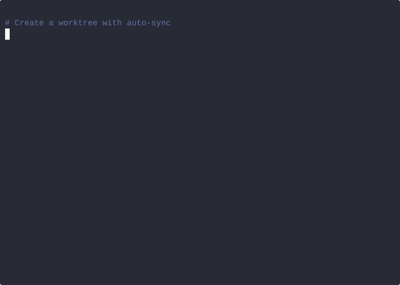

# workz

**Zoxide for Git worktrees** — zero-config dependency syncing, fuzzy switching, and AI-agent support.



Git worktrees let you work on multiple branches simultaneously, but they leave behind your `.env` files and force you to re-install `node_modules` every time. **workz** fixes this automatically.

## The Problem

```bash
git worktree add ../my-feature feature/login
cd ../my-feature
# Where's my .env? Gone.
# Where's node_modules? Gone. Time to wait for npm install again.
# Another 2GB of disk space wasted on duplicate dependencies.
```

## The Fix

```bash
workz start feature/login
# .env files copied, node_modules symlinked, you're in the worktree. Done.
```

## Features

- **Auto-symlink heavy directories** — `node_modules`, `target`, `.venv`, `vendor`, and 22+ more are symlinked, not duplicated
- **Auto-copy env files** — `.env`, `.env.local`, `.envrc`, `.npmrc`, secrets, and more carried over automatically
- **IDE config sync** — `.vscode`, `.idea`, `.cursor`, `.claude`, `.zed` symlinked automatically
- **Smart project detection** — auto-detects Node/Rust/Python/Go/Java projects and only syncs relevant dirs
- **Auto-install dependencies** — detects your package manager from lockfiles and installs if deps are missing
- **Fuzzy TUI switching** — skim-powered fzf-style fuzzy finder to jump between worktrees
- **Rich status dashboard** — `workz status` shows branch, dirty state, disk size, last commit age
- **Docker support** — `--docker` flag to auto-start containers, auto-stop on `done`
- **AI-agent ready** — launch Claude, Cursor, VS Code, Aider, Codex, Gemini, or Windsurf with `--ai`
- **Sync existing worktrees** — `workz sync` applies full setup to worktrees not created by workz
- **Shell integration** — `cd` into worktrees automatically, just like zoxide
- **Global + project config** — `~/.config/workz/config.toml` for defaults, `.workz.toml` per project
- **Zero config** — works out of the box for Node, Rust, Python, Go, and Java projects
- **Safe defaults** — never overwrites existing files, never force-deletes dirty worktrees

## Install

```bash
# Homebrew (macOS / Linux)
brew tap rohansx/tap
brew install workz

# Cargo
cargo install workz
```

Or build from source:

```bash
git clone https://github.com/rohansx/workz.git
cd workz
cargo install --path .
```

## Shell Setup

Add to your `~/.zshrc` (or `~/.bashrc`):

```bash
eval "$(workz init zsh)"
```

For fish, add to `~/.config/fish/config.fish`:

```fish
workz init fish | source
```

This gives you a `workz` shell function that auto-`cd`s into worktrees.

## Usage

### Create a worktree

```bash
workz start feature/login          # creates ../myrepo--feature-login
workz start bugfix/crash -b main   # branch from main instead of HEAD
workz start feature/auth --ai      # create + launch Claude Code
workz start feature/api --docker   # create + docker compose up
```

What happens:
1. Creates `../myrepo--feature-login` as a git worktree
2. Symlinks `node_modules`, `target`, `.venv` (if they exist in the main repo)
3. Copies `.env*` files into the new worktree
4. `cd`s you into the worktree (with shell integration)

### List worktrees

```bash
workz list
```

```
  main            /home/you/myrepo (bare)
  feature-login   /home/you/myrepo--feature-login  [modified] (142.3M)
  bugfix-crash    /home/you/myrepo--bugfix-crash (89.1M)
```

### Switch between worktrees

```bash
workz switch           # opens fzf-style fuzzy finder
workz switch login     # pre-fills query — fuzzy match to feature-login
```

### Remove a worktree

```bash
workz done                       # remove current worktree
workz done feature/login         # remove by branch name
workz done feature/login --force # force-remove even with uncommitted changes
workz done feature/login -d      # also delete the branch
```

### Sync an existing worktree

Already have worktrees created with `git worktree add`? No problem:

```bash
cd ../my-existing-worktree
workz sync                  # applies symlinks, copies .env files, installs deps
```

### Rich status dashboard

```bash
workz status
```

```
  main           /home/you/myrepo [modified]  342K  2 hours ago
  feature-login  /home/you/myrepo--feature-login  1.2M  5 minutes ago  [docker]
  bugfix-crash   /home/you/myrepo--bugfix-crash  890K  3 days ago
```

### Clean up stale entries

```bash
workz clean                        # prune stale worktree refs
workz clean --merged               # also remove worktrees with merged branches
workz clean --merged --base main   # specify base branch explicitly
```

## Configuration

workz supports two layers of configuration:

1. **Global** — `~/.config/workz/config.toml` (shared defaults across all repos)
2. **Project** — `.workz.toml` in your repo root (project-specific overrides)

Project config takes priority over global config.

```toml
[sync]
# Directories to symlink (shared, saves disk space)
symlink = ["node_modules", "target", ".venv", "vendor", "my-large-cache"]

# File patterns to copy into new worktrees
copy = [".env*", ".envrc", ".tool-versions", "secrets.json"]

# Patterns to never sync
ignore = ["logs", "tmp"]

[hooks]
# Run after creating a worktree
post_start = "pnpm install --frozen-lockfile"

# Run before removing a worktree
pre_done = "docker compose down"
```

Without a config file, workz uses sensible defaults that work for most projects.

### Default sync rules

**Symlinked directories** (27 dirs, project-type aware):
- **Node**: `node_modules`, `.next`, `.nuxt`, `.svelte-kit`, `.turbo`, `.parcel-cache`, `.angular`
- **Rust**: `target`
- **Python**: `.venv`, `venv`, `__pycache__`, `.mypy_cache`, `.pytest_cache`, `.ruff_cache`
- **Go**: `vendor`
- **Java/Kotlin**: `.gradle`, `build`
- **General**: `.direnv`, `.cache`
- **IDE configs**: `.vscode`, `.idea`, `.cursor`, `.claude`, `.zed`

**Copied files** (17 patterns):
- `.env`, `.env.*`, `.envrc`, `.tool-versions`, `.node-version`, `.python-version`, `.ruby-version`, `.nvmrc`, `.npmrc`, `.yarnrc.yml`, `docker-compose.override.yml`, `.secrets`, `.secrets.*`

### Auto-install

workz detects your package manager from lockfiles and installs dependencies if the deps directory is missing:

| Lockfile | Command |
|---|---|
| `bun.lockb` / `bun.lock` | `bun install --frozen-lockfile` |
| `pnpm-lock.yaml` | `pnpm install --frozen-lockfile` |
| `yarn.lock` | `yarn install --frozen-lockfile` |
| `package-lock.json` | `npm ci` |
| `uv.lock` | `uv sync` |
| `Pipfile.lock` | `pipenv install` |
| `poetry.lock` | `poetry install` |
| `requirements.txt` | `pip install -r requirements.txt` |

## Docker Support

If your project has a `docker-compose.yml` (or `compose.yml`), workz can manage containers automatically:

```bash
workz start feature/api --docker   # creates worktree + runs docker compose up -d
workz done feature/api             # stops containers + removes worktree
```

Supports both `docker compose` and `podman-compose` (prefers podman if available).

## AI Agent Workflow

Running multiple AI agents in parallel? Each one needs its own worktree:

```bash
workz start feature/auth --ai                       # launches Claude Code (default)
workz start feature/ui --ai --ai-tool cursor         # launches Cursor
workz start feature/api --ai --ai-tool aider         # launches Aider
workz start feature/test --ai --ai-tool codex        # launches OpenAI Codex CLI
workz start feature/x --ai --ai-tool gemini          # launches Gemini CLI
workz start feature/y --ai --ai-tool windsurf        # launches Windsurf
```

## How It Compares

| Feature | workz | worktrunk | gwq | fracture | branchlet |
|---|---|---|---|---|---|
| Auto-symlink deps | yes | config required | no | no | no |
| Auto-copy .env | yes | config required | config required | yes | no |
| Smart project detection | yes | no | no | no | no |
| Auto-install deps | yes | no | no | no | no |
| Fuzzy TUI (skim/fzf) | yes | no | yes | no | no |
| Docker integration | yes | no | no | no | no |
| Shell cd integration | yes | no | no | no | no |
| AI agent launch | yes | yes | no | no | no |
| Global + project config | yes | no | no | no | no |
| Zero config | yes | no | no | yes | no |
| Single binary | yes | yes | yes | ? | no (npm) |

## Requirements

- Git 2.15+ (for worktree support)
- A Unix-like system (Linux, macOS)

## License

MIT OR Apache-2.0
