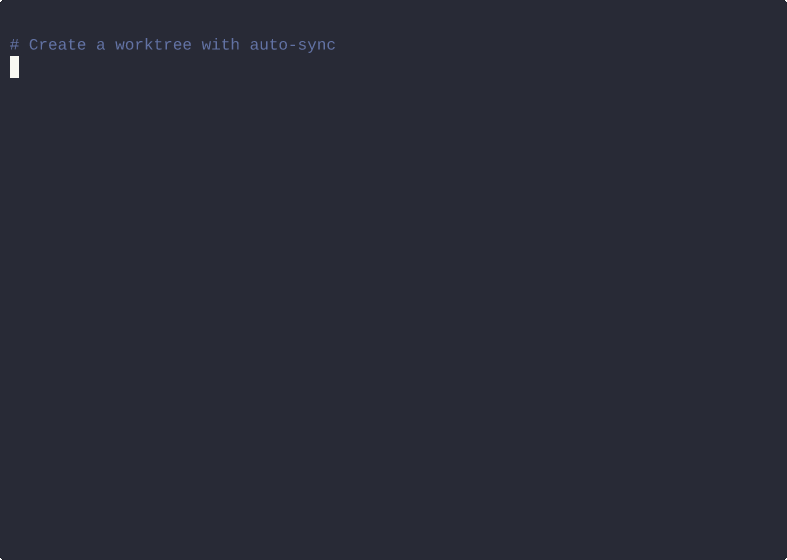

# workz

**Git worktree manager for AI-native development** — auto-synced dependencies, environment isolation, fleet orchestration, and a lazygit-style TUI.



## The Problem

```bash
git worktree add ../my-feature feature/login
cd ../my-feature
# Where's my .env? Gone.
# Where's node_modules? Gone. Time to wait for npm install again.
# Another 2GB of disk space wasted on duplicate dependencies.
# What port should this run on? Same as the other worktree?
```

## The Fix

```bash
workz start feature/login --isolated
# .env files copied, node_modules symlinked, PORT=3000-3009 assigned, you're in. Done.
```

## Install

```bash
# Homebrew (macOS / Linux)
brew tap rohansx/tap
brew install workz

# Cargo
cargo install workz
```

Or build from source:

```bash
git clone https://github.com/rohansx/workz.git
cd workz && cargo install --path .
```

## Shell Setup

```bash
# zsh (~/.zshrc) or bash (~/.bashrc)
eval "$(workz init zsh)"

# fish (~/.config/fish/config.fish)
workz init fish | source
```

## TUI Dashboard

Run `workz` with no arguments to launch the dashboard:

```bash
workz
```


4 panels show everything at a glance:

| Panel | Shows |
|-------|-------|
| **Worktrees** | All branches, dirty state, port allocations, last commit |
| **Fleet** | Parallel AI agent tasks, running/modified/clean status |
| **Files** | Modified files for the selected worktree (M/A/D/??) |
| **Ports** | Isolated port ranges and database names |

| Key | Action |
|-----|--------|
| `Tab` / `Shift+Tab` | Cycle panels |
| `j` / `k` | Navigate within panel |
| `n` | New worktree |
| `d` | Delete worktree |
| `s` | Sync worktree |
| `r` | Refresh all |
| `?` | Help |
| `q` | Quit |

## Usage

### Create a worktree

```bash
workz start feature/login            # create + auto-sync deps
workz start feature/auth --isolated  # create + assign PORT range + DB_NAME
workz start feature/api --ai         # create + launch Claude Code
workz start feature/ui --docker      # create + docker compose up
```

What happens:
1. Creates `../myrepo--feature-login` as a git worktree
2. Symlinks `node_modules`, `target`, `.venv` (project-aware, not duplicated)
3. Copies `.env*` files into the new worktree
4. Optionally assigns isolated PORT range, DB_NAME, COMPOSE_PROJECT_NAME

### List and switch

```bash
workz list              # show all worktrees with size and status
workz switch            # fzf-style fuzzy finder
workz switch login      # pre-fills query
workz status            # rich status with ports, docker, commit age
```

### Remove a worktree

```bash
workz done                        # remove current worktree
workz done feature/login --force  # force-remove with uncommitted changes
workz done feature/login -d       # also delete the branch
workz done feature/login --cleanup-db  # also drop the isolated database
```

### Sync existing worktrees

```bash
cd ../my-existing-worktree
workz sync   # applies symlinks, copies .env, installs deps
```

### Clean up

```bash
workz clean                  # prune stale worktree refs
workz clean --merged         # also remove merged branches
```

## Environment Isolation

`--isolated` gives each worktree its own port range, database, and compose project — no collisions between worktrees.

```bash
workz start feat/auth --isolated
# PORT=3000  PORT_END=3009  DB_NAME=feat_auth  COMPOSE_PROJECT_NAME=feat_auth

workz start feat/api --isolated
# PORT=3010  PORT_END=3019  DB_NAME=feat_api   COMPOSE_PROJECT_NAME=feat_api
```

All values are written to `.env.local` in the worktree. workz detects 14 web frameworks and writes framework-specific variables:

| Framework | Extra env var |
|-----------|--------------|
| Spring Boot | `SERVER_PORT` |
| Flask | `FLASK_RUN_PORT` |
| FastAPI | `UVICORN_PORT` |
| Vite | `VITE_PORT` |

Port ranges are allocated in aligned 10-port blocks (configurable) and tracked in `~/.config/workz/ports.json`. Released automatically on `workz done`.

## Fleet Mode

Orchestrate parallel AI agents across isolated worktrees.

```bash
# Spin up 3 Claude agents in parallel
workz fleet start \
  --task "add user authentication" \
  --task "write integration tests" \
  --task "refactor database layer" \
  --agent claude

# Watch all agents live
workz fleet status

# Run tests across all fleet worktrees
workz fleet run "cargo test"

# Merge completed work back
workz fleet merge

# Or open a PR for each
workz fleet pr --draft

# Tear it all down
workz fleet done
```

Load tasks from a file:

```bash
workz fleet start --from tasks.txt --agent claude
```

## AI Agent Workflow

Launch any AI coding tool in a fresh worktree:

```bash
workz start feature/auth --ai                    # Claude Code (default)
workz start feature/ui --ai --ai-tool cursor     # Cursor
workz start feature/api --ai --ai-tool aider     # Aider
workz start feature/test --ai --ai-tool codex    # OpenAI Codex CLI
workz start feature/x --ai --ai-tool gemini      # Gemini CLI
workz start feature/y --ai --ai-tool windsurf    # Windsurf
```

## MCP Server

workz ships a built-in MCP server so AI agents can manage worktrees autonomously.

```bash
claude mcp add workz -- workz mcp
```

Or add to `~/.claude/settings.json`:

```json
{
  "mcpServers": {
    "workz": {
      "command": "workz",
      "args": ["mcp"]
    }
  }
}
```

### Tools exposed

| Tool | Description |
|------|-------------|
| `workz_start` | Create a worktree (supports `--isolated`) |
| `workz_list` | List all worktrees as JSON |
| `workz_status` | Branch, dirty state, last commit |
| `workz_sync` | Re-sync symlinks/env into a worktree |
| `workz_done` | Remove a worktree (optional force) |
| `workz_conflicts` | Detect files modified in multiple worktrees |

## Web Dashboard

```bash
workz serve           # localhost:7777
workz serve -p 8080   # custom port
```

## What Gets Synced

**Symlinked directories** (27 dirs, project-type aware — only syncs what's relevant):

| Project | Directories |
|---------|------------|
| Node.js | `node_modules`, `.next`, `.nuxt`, `.svelte-kit`, `.turbo`, `.parcel-cache`, `.angular` |
| Rust | `target` |
| Python | `.venv`, `venv`, `__pycache__`, `.mypy_cache`, `.pytest_cache`, `.ruff_cache` |
| Go | `vendor` |
| Java/Kotlin | `.gradle`, `build` |
| General | `.direnv`, `.cache` |
| IDE | `.vscode`, `.idea`, `.cursor`, `.claude`, `.zed` |

**Copied files** (17 patterns):
`.env`, `.env.*`, `.envrc`, `.tool-versions`, `.node-version`, `.python-version`, `.ruby-version`, `.nvmrc`, `.npmrc`, `.yarnrc.yml`, `docker-compose.override.yml`, `.secrets`, `.secrets.*`

**Auto-install** (detected from lockfiles):

| Lockfile | Command |
|----------|---------|
| `bun.lockb` / `bun.lock` | `bun install --frozen-lockfile` |
| `pnpm-lock.yaml` | `pnpm install --frozen-lockfile` |
| `yarn.lock` | `yarn install --frozen-lockfile` |
| `package-lock.json` | `npm ci` |
| `uv.lock` | `uv sync` |
| `Pipfile.lock` | `pipenv install` |
| `poetry.lock` | `poetry install` |
| `requirements.txt` | `pip install -r requirements.txt` |

## Configuration

Two layers — project overrides global:

1. **Global** — `~/.config/workz/config.toml`
2. **Project** — `.workz.toml` in repo root

```toml
[sync]
symlink = ["node_modules", "target", ".venv", "my-large-cache"]
copy = [".env*", ".envrc", "secrets.json"]
ignore = ["logs", "tmp"]

[hooks]
post_start = "pnpm install --frozen-lockfile"
pre_done = "docker compose down"

[isolation]
port_range_size = 10   # ports per worktree (default: 10)
base_port = 3000       # first port (default: 3000)
```

Zero config works out of the box for Node, Rust, Python, Go, and Java projects.

## Docker Support

```bash
workz start feature/api --docker   # creates worktree + runs docker compose up -d
workz done feature/api             # stops containers + removes worktree
```

Supports both `docker compose` and `podman-compose`.


